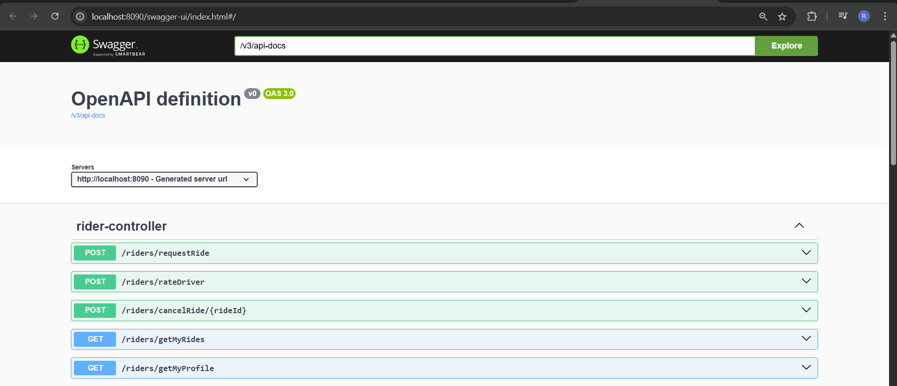
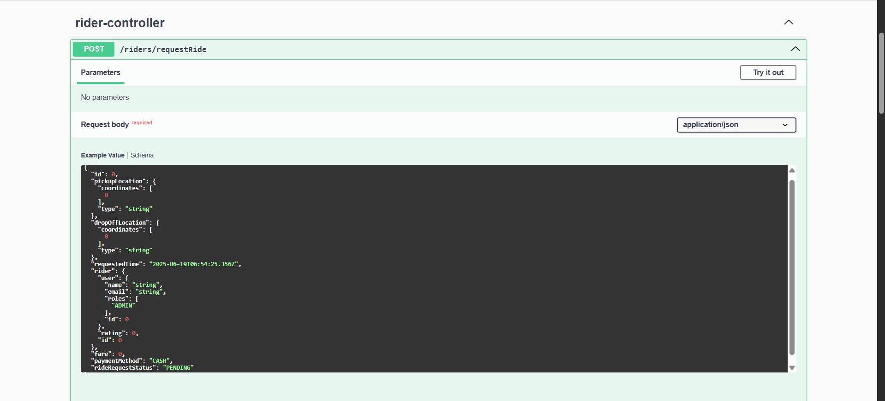
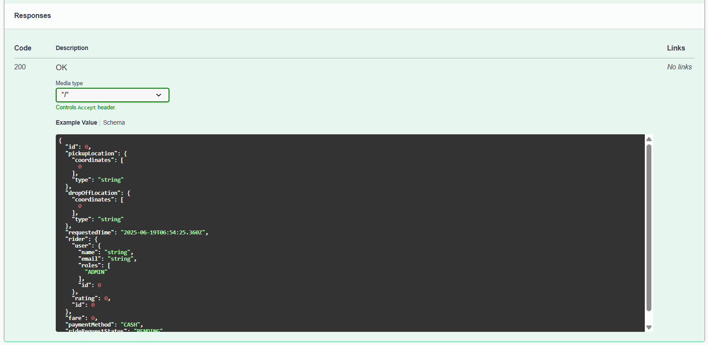
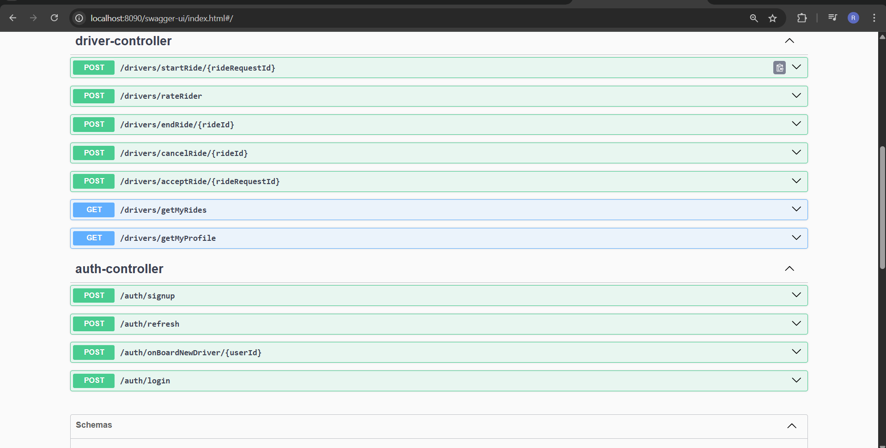
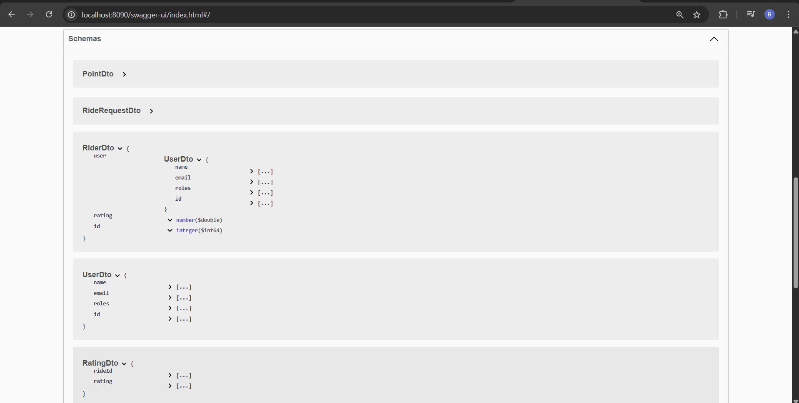
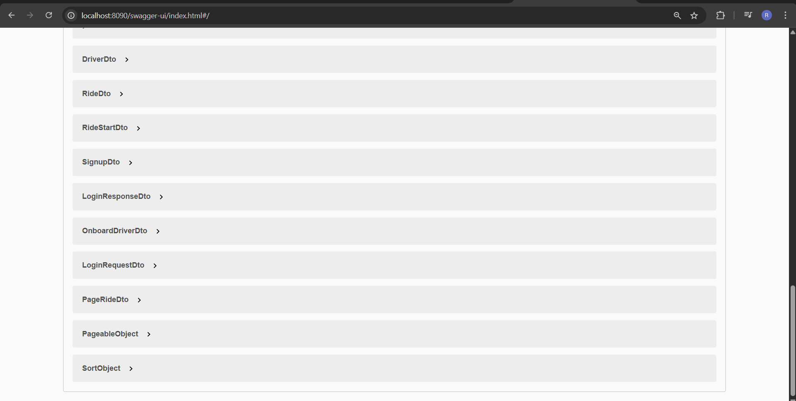
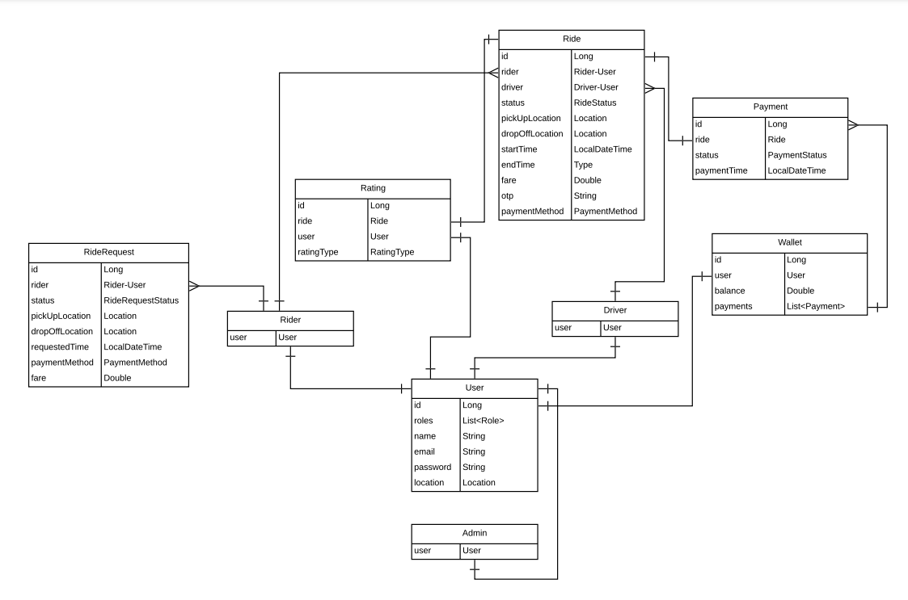
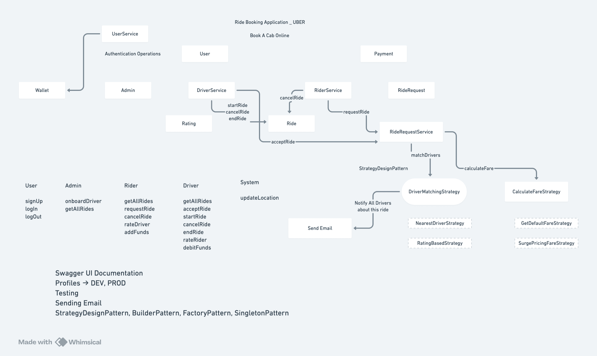

# 🚗 Uber Backend Application

A backend application developed using **Spring Boot**, simulating key functionalities of a ride-sharing platform like Uber. This system enables features like ride booking, driver-rider matching, user management, and secure authentication using JWT.

---

## ⚙️ Tech Stack

- **Java**
- **Spring Boot**
- **Spring Data JPA & Hibernate**
- **Spring Security with JWT**
- **MySQL Database**
- **Maven**
- **Lombok**
- **MapStruct**
- **ModelMapper**
- **Postman** (API Testing)
- **IntelliJ IDEA** (IDE)
- **Swagger UI** (API Documentation)
- **External API Used**: [OSRM - Open Source Routing Machine](http://project-osrm.org) for real-time routing and map path calculation.

---

## 🔐 Authentication & Authorization

- JWT-based authentication with Spring Security.
- Role-based authorization (e.g., DRIVER, RIDER, ADMIN).
- Bcrypt used for password hashing.
- Token-based secure APIs for login, signup, and protected routes.

---

## 🚀 Key Features

- ✅ Driver and Rider Registration/Login
- ✅ Secure JWT Auth
- ✅ Book Ride & Match with Nearest Driver using OSRM
- ✅ Ride History & Trip Management
- ✅ Driver Location Update
- ✅ Admin User Management
- ✅ Swagger UI Documentation
- ✅ Global Exception Handling

---

## 🌍 External APIs
OSRM API (Open Source Routing Machine)
→ Used to calculate distance and estimated time between source and destination coordinates for each ride.

---

## 🛠 Developer Tools
IntelliJ IDEA (for development), 
Postman (for API testing),
Swagger (for API documentation)

---

## 📫 API Endpoints (via Swagger)

| Method | Endpoint | Description |
|--------|----------|-------------|
| `POST` | `/api/auth/register` | Register as Rider/Driver |
| `POST` | `/api/auth/login` | Login and receive JWT token |
| `POST` | `/api/rides/book` | Book a ride |
| `GET`  | `/api/rides/history` | Rider’s ride history |
| `PUT`  | `/api/drivers/update-location` | Driver location update |
| `GET`  | `/api/admin/users` | Get all users (admin only) |
| `GET`  | `/swagger-ui/index.html` | Access Swagger API docs |

---

## 🧩 Project Structure

```
uberApp/
├── configs/
├── controllers/
├── dto/
├── entities/
├── exceptions/
├── repositories/
├── security/
├── services/
├── strategies/
└── utils/
```

---

## 📸 Screenshots

### 1. Swagger UI - Rider Controllers


### 2. Swagger UI - Ride Request Body


### 3. Swagger UI - Ride Response Body


### 4. Swagger UI - Driver and Auth Controllers


### 5. Swagger UI - schemas


### 6. Swagger UI - schemas


---

## 📊 UML Class Diagram



---

## 🔁 Flow Diagram



---

## ✅ Getting Started

```bash
git clone https://github.com/yourusername/uberApp.git
cd uberApp
mvn clean install
```
- Open in IntelliJ and run the application.
- Swagger: `http://localhost:8080/swagger-ui/index.html`

---

## ✍️ Author

> Developed by **Rohit Dhumal** – A backend-focused full-stack Java developer 🚀

